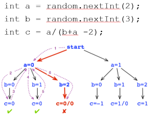

# Exercise 5 - Static Analysis

In this exercise, you will use three static analysis tools to test a program: a
bug finder named SpotBugs, a linter named CheckStyle, and a model checker named
Java Pathfinder (JPF).  SpotBugs and CheckStyle work in similar ways in that
both look for patterns that are either symptomatic of a bug (former) or are bad
coding style (latter).  So we will look at them together first.  Later we will
look at JPF which is much more rigorous and can prove a program correct.

## SpotBugs and CheckStyle

SpotBugs: https://spotbugs.github.io/  
CheckStyle: https://checkstyle.sourceforge.io/  

Try running both tools on a Sieve of Eratosthenes program, and then fix any
issues found.  This will allow you to see what kinds of bugs a static analysis
program can find (and which ones it cannot).

The Sieve of Eratosthenes is an ancient way of finding all prime numbers below
a specific value.  For details on the algorithm itself, please see
https://en.wikipedia.org/wiki/Sieve_of_Eratosthenes.

This program accepts one integer value and will tell you all prime numbers up
to and including the passed-in value.  However, there are some problems hidden
in the code.  You are going to use SpotBugs and CheckStyle to find and fix
them.  Some problems are actual defects and some are just bad or confusing
code.

I have prepared scripts to run or test the program.  First cd into the Sieve
directory before executing the scripts.

To run the program (for Windows users):
```
$ run.bat [Integer]
```
To run SpotBugs:
```
$ runSpotbugs.bat
```
To run CheckStyle:
```
$ runCheckstyle.bat
```

For Mac or Linux users, please run the corresponding .sh scripts.

* There is a GUI for SpotBugs if that is what you prefer.  You can launch the GUI by using the following command:
```
$ java -jar spotbugs-4.0.0-beta4/lib/spotbugs.jar
```
The following link contains a short tutorial on how to use the GUI:
https://spotbugs.readthedocs.io/en/latest/gui.html

If all goes well you should see the following output:

```
$ java Sieve 100
Sieve of Eratosthenes
> 2 3 5 7 11 13 17 19 23 29 31 37 41 43 47 53 59 61 67 71 73 79 83 89 97

$ java Sieve 14
Sieve of Eratosthenes
> 2 3 5 7 11 13
```

Note that there is a bug in the logic of the code that is not caught by either
SpotBugs or CheckStyle that will prevent you from getting the above output.
Since both work by pattern matching they are bad at finding logic problems.
That is part of the lesson you should learn from this exercise.

## Java Pathfinder (JPF)

Java Pathfinder (JPF): 
https://github.com/javapathfinder/jpf-core/wiki
http://javapathfinder.sourceforge.net/

Java Pathfinder is a tool developed by NASA to model check Java programs.  It
works in exactly the same way we learned in class: it does an exhaustive and
systematic exploration of program state space to check for correctness.  Let's
first try out JPF on the example we saw on the Formal Verification lecture
slides:
{:height="50%" width="50%"}
